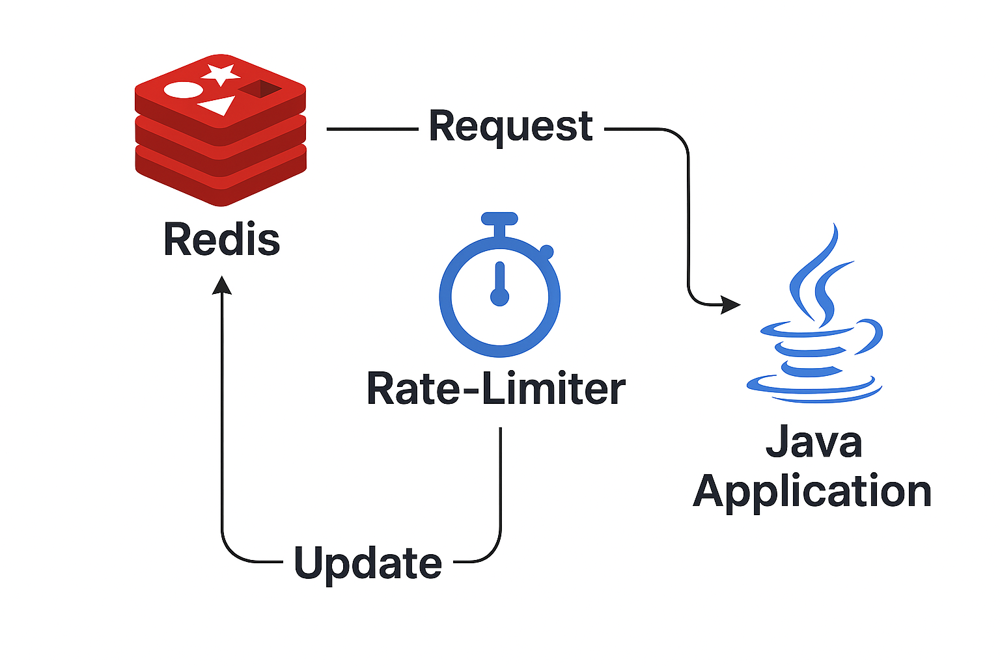

# Rate Limiter com Spring Boot e Redis



Este projeto implementa um sistema de rate limiting para APIs REST usando Spring Boot e Redis. O objetivo é limitar o número de requisições que um cliente pode fazer em um determinado intervalo de tempo.

## Funcionalidades

- Limita o número de requisições por IP em uma janela de tempo configurável.
- Utiliza Redis para armazenar contadores de requisições.
- Retorna HTTP 429 (Too Many Requests) quando o limite é excedido.
- Testes automatizados com MockMvc.

## Estrutura do Projeto

- `src/main/java/com/meurer/ratelimiter/`: Código principal da aplicação.
- `src/main/java/com/meurer/ratelimiter/config/`: Configurações do rate limiter.
- `src/main/java/com/meurer/ratelimiter/controller/`: Controller de teste.
- `src/test/java/com/meurer/ratelimiter/`: Testes automatizados.
- `docker-compose.yml`: Configuração do Redis via Docker.

## Pré-requisitos

- Java 17+
- Maven
- Docker (para rodar o Redis)

## Passo a Passo para rodar a aplicação

1. **Suba o Redis com Docker**

   No diretório do projeto, execute:

   ```sh
   docker-compose up -d
   ```

2. **Configure environment variables (if necessary)**

   - The `application.properties` file is already configured to connect to the default Redis (`localhost:6379`).
   - If you change the Redis configuration, update the file at `src/main/resources/application.properties`.

3. **Build and run the Spring Boot application**

   In the project directory, run:

   ```sh
   mvn clean install
   mvn spring-boot:run
   ```

4. **Test the API**

   - Access the test endpoint: `http://localhost:8080/test`
   - Make requests to verify the rate limiter functionality.

5. **Run automated tests**

   ```sh
   mvn test
   ```

## How to run the application with Redis

### 1. Start Redis with Docker

In the project directory, run:

```sh
docker-compose up -d
```

## Running with Docker on WSL (Windows Subsystem for Linux)

If you are using Docker installed on WSL:

1. Open your WSL terminal (e.g., Ubuntu).
2. Navigate to your project directory (where the `docker-compose.yml` file is located). For example:
   ```sh
   cd /path/to/your/project
   ```
3. Make sure Docker Desktop is running on Windows.
4. Run the following command to start Redis:
   ```sh
   docker-compose up -d
   ```

If you encounter permission issues, try running the command with sudo:
```sh
sudo docker-compose up -d
```

Now you can proceed with the rest of the steps (build, run, test) as described acima.
